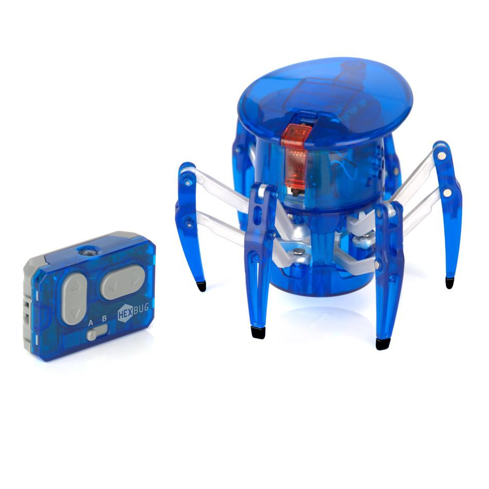
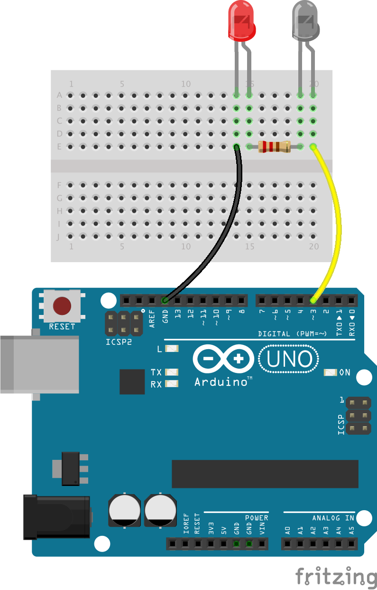

Turning a $30 toy robot into a remote controllable webcam
=========================================================

---

Vancouver Hack & Tell

December 3rd, 2019

DrDub

---

What
----

An arduino / PC controlled Hexbug Spider with a webcam on top. Useful
for videoconferencing.

---

Hexbug Spiders
--------------

$30 toys, with IR remote controls. Two channels. Battle bots!




---

How
---

A simple hack on top of https://github.com/xiam/arduino_hexbug_spider



---

Website control
---------------

Python flask code that uses serial communication to the Arduino to
expose the 4 commands (Left, Right, Forward, Backward) via a website.

```bash
FLASK_APP=start python -m flask run -h 0.0.0.0 -p 8080
```

If you go to http://localhost:8080/control and click on the text box,
you can control the Hexbug Spider using the arrow keys.

If you want to access the website remotely you'll need a way to
forward that port outside your firewall, if needed.

---

Demo
====


